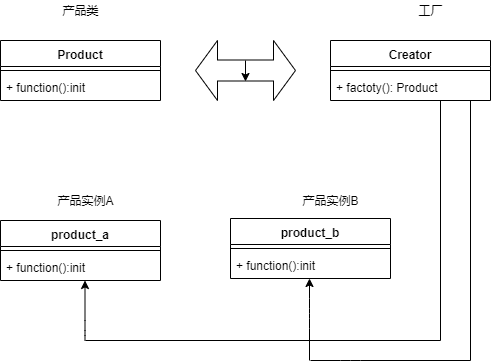

## 设计模式初探——工厂模式
### 工厂模式
将构造函数和创建者进行分离
### UML


### 代码实现
```
export class FormField {
    public reg: RegExp;
    public name: string;
    constructor( name: string, reg: RegExp) {
        this.name = name;
        this.reg = reg;
    }

    public init(): void {
        console.log('字段校验初始化完成');
    }

    public getReg(): string {
        return `reg:${this.reg}`;
    }

    public verifyField(val: string): boolean {
        return this.reg.test(val);
    }
}

export class Factory {
    public create(name: string, reg: RegExp): FormField {
        return new FormField(name, reg);
    }
}

```
### 代码测试
#### 测试用例
```
test('factor init', (t) => {
    const factor = new Factory();
    t.true(factor instanceof Factory);
});

test('reg init', (t) => {
    const factor = new Factory();
    // 构建邮箱校验器
    const product1 = factor.create('email', /\w+([-+.]\w+)*@\w+([-.]\w+)*\.\w+([-.]\w+)*/);

    t.true(product1.verifyField('yongfeide123@sina.com'))

    // 构建电话校验器
    const product2 = factor.create('phone', /^1[3|4|5|8][0-9]\d{4,8}$/);

    t.true(product2.verifyField('18660683370'))
});

test('reg instanceof', (t) => {
    const factor = new Factory();
    const product1 = factor.create('email', /\w+([-+.]\w+)*@\w+([-.]\w+)*\.\w+([-.]\w+)*/);
    const product2 = factor.create('phone', /^1[3|4|5|8][0-9]\d{4,8}$/);
    t.true(product1 instanceof FormField)
    t.true(product2 instanceof FormField)
});

```
#### 测试结果
```
> tsc test/Factory.test.ts && ava -v test/Factory.test.js


  √ factor init
  √ reg init
  √ reg instanceof
  ─

  3 tests passed

Process finished with exit code 0
```
### 经典场景
1. jQuery
2. React.createElement()
