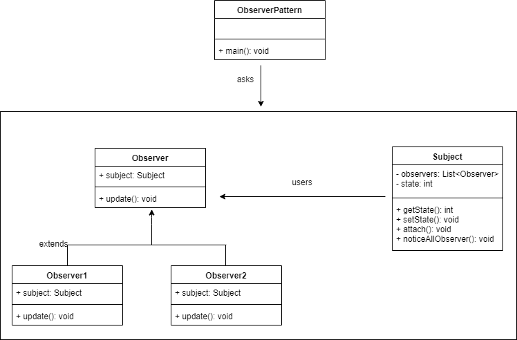

## 设计模式初探——观察者模式（一）
### 观察者模式
**观察者模式指的是一个对象（Subject）[被观察者]维持一系列依赖于它的对象（Observer）[观察者]，当有关状态发生变更时 Subject 对象则通知一系列 Observer 对象进行更新。**
1. 一个目标者对象 Subject，拥有方法：添加 / 删除 / 通知 Observer；
2. 多个观察者对象 Observer，拥有方法：接收 Subject 状态变更通知并处理；
3. 目标对象 Subject 状态变更时，通知所有 Observer。

### UML


### 代码实现
```
// 基础版观察者模式
export class Subject {
    private observers : Observer[] = new Array<Observer>();
    private state: number;

    public getState(): number {
        return this.state;
    }

    public setState(state: number) {
        this.state = state;
        this.notifyAllObservers();
    }

    attach(observer: Observer){
        this.observers.push(observer);
    }

    notifyAllObservers(){
        for (let observer of this.observers) {
            observer.update();
        }
    }
}


export abstract class Observer {
    protected subject: Subject;
    public abstract update();
}

export class Observer1 extends Observer{

    constructor(subject: Subject){
        super();
        this.subject = subject;
        this.subject.attach(this);
    }

    update() {
        console.log( "Observer1: "
            + this.subject.getState() );
    }
}

export class Observer2 extends Observer{

    constructor(subject: Subject){
        super();
        this.subject = subject;
        this.subject.attach(this);
    }

    update() {
        console.log( "Observer2: "
            + this.subject.getState() );
    }
}


```
### 代码测试
#### 测试用例
```
test('observer', (t => {
    let subject = new Subject();

    new Observer1(subject);
    new Observer2(subject);

    subject.setState(1);
    t.is(subject.getState(), 1);
    subject.setState(2);
    t.is(subject.getState(), 2);
}));

```
#### 测试结果
```
> tsc test/Observer.test.ts && ava -v test/Observer.test.js

Observer1: 1
Observer2: 1
Observer1: 2
Observer2: 2
  √ observer
  ─
  1 test passed
Process finished with exit code 0
```
### 经典场景
观察者模式在前端领域中是应用频率最高的设计模式。
1. Promise
```
// 模拟异步
const testPromise = new Promise(((resolve, reject) => {
    setTimeout(() => {
        const flag: boolean = Boolean(Math.round(Math.random()));
        if (flag) {
            resolve({data: 'success'})
        }else  {
            reject({data: 'error'})
        }

    }, 2000)
}))

testPromise.then((res: any) => {
    console.log(res);
}).catch((err) =>{
    console.log(err);
})
```
2. node自定义事件
```
import * as events from "events";
const EventEmitter = events.EventEmitter;

// 继承EventEmitter时BaseEmit中已经包含了on   emit等一系列属性和方法
class BaseEmit  extends EventEmitter{
    public name: string = '';
    constructor(name: string){
        super();
        this.name = name;
    }

    public setValue(name: string) {
        this.name = name;
    }
}
const testEmit = new BaseEmit('initValue');

// 监听valueChange方法
testEmit.on('valueChange', () => {
    console.log(testEmit.name)
});

// 异步触发valueChange方法
setTimeout(() => {
    // 触发修改name
    testEmit.setValue('firstChangeValue')
    testEmit.emit('valueChange', () => {})
}, 3000)

// 异步触发valueChange方法
setTimeout(() => {
// 触发修改name
    testEmit.setValue('secondChangeValue')
    testEmit.emit('valueChange', () => {})
}, 6000)

```
3. vue中$emit
4. vue中watch
### 适用场景
1. 对一个对象状态的更新，需要其他对象同步更新，而且其他对象的数量动态可变
2. 对象仅需要将自己的更新通知给其他对象而不需要知道其他对象的细节。

### 优缺点
#### 优点
1. 实现了被观察者和观察者的解耦。
2. 消息的广播。
#### 缺点
1. 如果一个被观察者对象有很多的直接和间接的观察者的话，将所有的观察者都通知到会花费很多时间。
2. 需要特殊考虑循环依赖的问题（nest, angular中循环依赖）【JAVA 中已经有了对观察者模式的支持类， ts, js需要特殊处理】
### 发布订阅
观察者模式中观察者和目标直接进行交互，而发布订阅模式中统一由调度中心进行处理，订阅者和发布者互不干扰。
基于一个事件（主题）通道，希望接收通知的对象 Subscriber 通过自定义事件订阅主题，被激活事件的对象 Publisher 通过发布主题事件的方式通知各个订阅该主题的 Subscriber 对象。
#### 代码实现
```
export class PubEvent{
    constructor(){
        this.clientList = {}
    }
    listen(key,fn){
        if(!this.clientList[key]){
            this.clientList[key] = []
        }
        this.clientList[key].push(fn)
    }
    trigger(key,...args){
        let fns = this.clientList[key]
        if(!fns || fns.length === 0){
            return false
        }
        fns.forEach(fn=>{
            fn(...args)
        })
    }
    remove(key, fn){
        let fns = this.clientList[key]
        if(!fns){
            return false
        }
        if(!fn){
            fns && fns(fns.length = 0)
        }else{
            for ( let l = fns.length - 1; l >= 0; l-- ){
                let _fn = fns[ l ]
                if ( _fn === fn ){
                    fns.splice( l, 1 )
                }
            }
        }
    }
}

```
#### 基本使用
```
// 订阅事件回调
const testValueChange = (val: string) => {
    console.log(val)
}
// 实例化一个事件调度中心
const _globalEvent: PubEvent = new PubEvent()

// 监听testValueChange事件，回调函数为testValueChange
_globalEvent.listen('testValueChange', testValueChange)

setTimeout(() => {
    // 发布一个testValueChange的事件
    _globalEvent.trigger('testValueChange', 'firstValue')
}, 2000)
```
#### 场景
```
ele.addEventListener('click', () => {});
```

