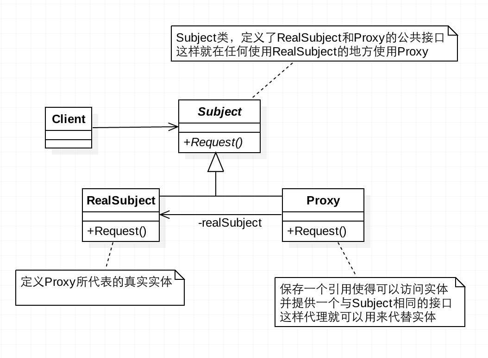

## 设计模式初探——代理器模式
### 代理器模式
使用者无权限直接访问目标对象，通过代理进行授权和控制。
### UML


### 代码实现
```
interface Image {
    display();
}

export class RealImage implements Image {
    protected fileName: string;

    constructor(fileName: string){
        this.fileName = fileName;
        this.loadFromDisk(fileName);
    }

    public display(): string {
        return `Displaying ${this.fileName}`
    }

    public loadFromDisk(fileName: string): void{
        console.log("Loading " + fileName);
    }
}

export class ProxyImage implements Image{

    public realImage : RealImage;
    public fileName : string;

    constructor(fileName: string){
        this.fileName = fileName;
    }

    public display(): string {
        if(this.realImage == null){
            this.realImage = new RealImage(this.fileName);
        }
        return this.realImage.display();
    }
}


let img = new ProxyImage('A.png');
console.log(img.display());


```
### 代码测试
#### 测试用例
```
test('test', (t => {
    let img = new ProxyImage('A.png');
    t.is(img.display(), 'Displaying A.png')
}));

```
#### 测试结果
```
> tsc test/Proxy.test.ts && ava -v test/Proxy.test.js

Loading A.png
Displaying A.png
Loading A.png
  √ test
  ─

  1 test passed

Process finished with exit code 0
```
### 经典场景
1. Es6 Proxy
2. 网页事件代理
#### ES6 Proxy
vue3已经全面采用ES6的Proxy替代2.0中的prototype
##### 代码实现
```
const testObj = {
    age: 16
}
const proxyObj = new Proxy(testObj, {
    get(target: { age: number }, p: string | number | symbol, receiver: any): any {
        console.log('通过get ---- age');
        return target[p];
    },

    set(target: { age: number }, p: string | number | symbol, value: any, receiver: any): boolean {
        console.log('通过set ---- age');
        if (value > 100) {
            console.log('年龄不能大于100');
            return false;
        }
        target[p] = value;
        console.log('通过set ---- age  success');
        return true
    }
});
```
##### 测试用例
```
console.log(proxyObj.age);
proxyObj.age = 102
console.log(proxyObj.age);
proxyObj.age = 32
console.log(proxyObj.age);

```
##### 用例测试
```
通过get ---- age   
16               // proxyObj.age操作必须先通过get 拦截器

通过set ---- age  // proxyObj.age设置值必须先通过set 拦截器
年龄不能大于100    // set拦截器中拦截了非法值
通过get ---- age
16
通过set ---- age
通过set ---- age  success
通过get ---- age
32
```

#### TypeScript get set
##### 代码实现
```
class TsProxy {
    private _age: number = 0;

    public set age (value: number) {
        console.log('start set value')
        if (value > 100) {
            console.log('age 不能大于100')
            this._age = 100;
        }else {
            this._age = value;
        }

    }

    public get age () {
        console.log('start get value')
        return this._age;
    }
}
```
##### 测试用例
```
const s: TsProxy = new TsProxy();
s.age = 1205;
console.log(s.age);

s.age = 12;
console.log(s.age);

```
##### 用例测试
```
start set value
age 不能大于100
start get value
100
start set value
start get value
12
```
### 优缺点
#### 优点
1. 代理模式能将代理对象与被调用对象分离，降低了系统的耦合度。
2. 保护目标对象(操作者无法直接操作目标对象)。
2. 代理对象可以扩展目标对象的功能。
#### 缺点
1. 处理请求速度可能有差别，非直接访问存在开销。
