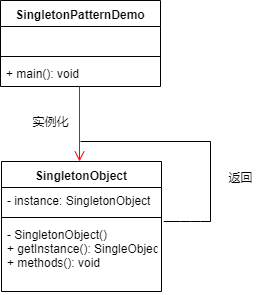

## 设计模式初探——单例模式
### 单例模式
单例模式，属于创建类型的设计模式。通过单例模式的方法创建的类在当前进程中只有一个实例,如jQuery的使用，无论引入多少次，当前window中只有一个jQuery的实例。

### UML


### 代码实现
#### 构造器内部保存实例
```
export class Singleton {
    private static _instance : Singleton;
    private constructor(){};
    static getInstance(): Singleton{
        if(this._instance){
            return this._instance;
        }
        this._instance = new Singleton();
        return this._instance;
    }
}

```
#### 通过闭包保存实例
```
let closure = (() => {
    let _instance;
    return (instance = null) => {
        if(_instance) return _instance;
        if(instance) _instance = instance;
        return _instance;
    }
})();

// 闭包模式保存
export class SingletonClosure{
    private constructor(){};

    static getInstance(){
        if(!closure()){
            return closure(new SingletonClosure())
        }
        return closure();
    }
}
```
### 代码测试
#### 测试用例
```
test('test', (t => {
    let instance1 = Singleton.getInstance();
    let instance2 = Singleton.getInstance();
    t.true(instance1 instanceof Singleton);
    t.true(instance2 instanceof Singleton);
    t.true(instance2 === instance1);
}));

test('test1', (t => {
    let instance1 = SingletonClosure.getInstance();
    let instance2 = SingletonClosure.getInstance();
    t.true(instance1 instanceof SingletonClosure);
    t.true(instance2 instanceof SingletonClosure);
    t.true(instance2 === instance1);
}));

```
#### 测试结果
```
> tsc test/Singleton.test.ts && ava -v test/Singleton.test.js

true
true
true
  √ test
  √ test1
  ─

  2 tests passed

Process finished with exit code 0
```
### 经典场景
1. jQuery
2. vuex  redux
### 适用场景
1. 对象需要被公用的场合适合使用，如（有状态的工具类对象【vuex】）
2. 程序中只需要一个实例。

### 优缺点
#### 优点
1. 实现了整个程序对唯一实例访问的控制。
2. 对于那些需要频繁创建和销毁的对象来说可以提高系统的性能，并且可以节省内存空间。
3. 可以全局访问。
#### 缺点
1. 不适用于变化频繁的对象。
2. 可扩展性较差。
3. 如果实例化的对象长时间不被利用，系统会认为该对象是垃圾而被回收，可能会导致对象状态的丢失。（暂时未作验证【前端领域】）
